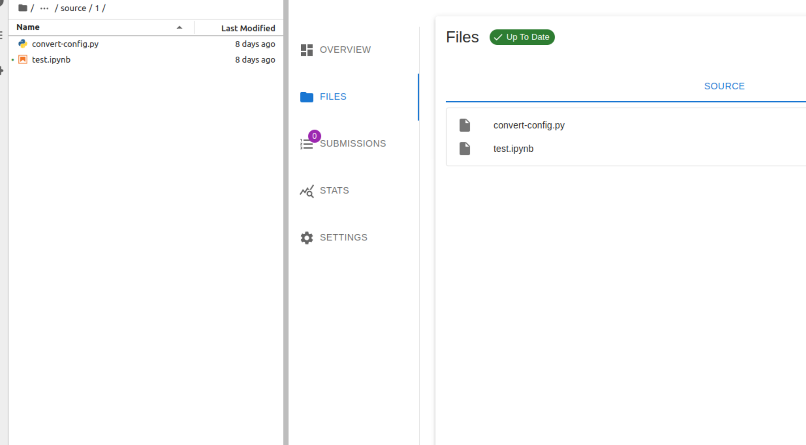
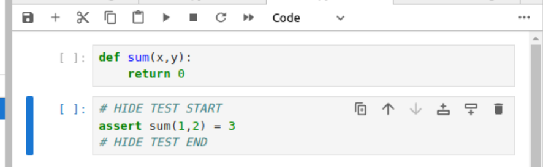
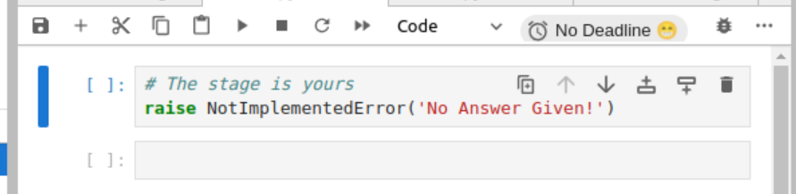

# Customizing Assignment Creation with grader_config.py

Instructors have the ability to customize the grading process using a configuration file named `grader_config.py`. This file should reside in the same directory as the assignment notebooks you wish to grade.

## How to Use `grader_config.py`

1. **Create a `grader_config.py` File**
   : Create this file in the directory that houses your assignment notebooks.




2. **Edit the Configurations**
   : Open the `grader_config.py` file in a text editor and edit the configurations. Here are some commonly used options:

     - **Customizing the Code Stub for Solution Cells**
       : Normally, solution cells are replaced with `raise NotImplementedError()`. Modify this default behavior like so:

         ```python
         c.ClearSolutions.code_stub = { 'python': "# The stage is yours\nraise NotImplementedError('No Answer Given!')" }
         ```
     - **Changing Delimiters for Hidden Tests**
       : By default, the grader identifies hidden tests using "BEGIN HIDDEN TESTS" and "END HIDDEN TESTS". You can modify these by setting the following:

         ```python
         c.ClearHiddenTests.begin_test_delimiter = "HIDE TEST START"
         c.ClearHiddenTests.end_test_delimiter = "HIDE TEST END"
         ```
3. **Save the Configuration**
   : After setting your configurations, save the `grader_config.py` file.

This way the grader service would generate following assignment:




From following assignment notebook:



## Applying Custom Configurations

Once the `grader_config.py` file is saved in the appropriate directory, the grader service will automatically use these configurations during the creation process.

## Sample `grader_config.py`

Here is a sample `grader_config.py` template for reference:

```python
# Grader Convert Configuration File

# -------------------------------------------------
# ClearSolutions Configuration
# -------------------------------------------------

# `code_stub` replaces the content of solution cells with a language-specific code snippet.
# Instructors can override these placeholders with the code snippets of their choice.
c.ClearSolutions.code_stub = {
    'python': "# YEEETE\nraise NotImplementedError()",  # Placeholder for Python solution cells
    'matlab': "% YOUR CODE HERE\nerror('No Answer Given!')",  # Placeholder for MATLAB solution cells
    'octave': "% YOUR CODE HERE\nerror('No Answer Given!')",  # Placeholder for Octave solution cells
    # ... (More languages)
}

# -------------------------------------------------
# ClearAlwaysHiddenTests Configuration
# -------------------------------------------------

# Delimiters for always hidden utilities.
# Blocks of code between these delimiters will always be hidden in the notebook.
c.ClearAlwaysHiddenTests.begin_util_delimeter = "BEGIN ALWAYS HIDDEN UTILS"  # Start delimiter
c.ClearAlwaysHiddenTests.end_util_delimeter = "END ALWAYS HIDDEN UTILS"  # End delimiter

# -------------------------------------------------
# ClearHiddenTests Configuration
# -------------------------------------------------

# Delimiters for hidden tests.
# Blocks of code between these delimiters will be hidden in the notebook.
c.ClearHiddenTests.begin_test_delimeter = "BEGIN HIDDEN TESTS"  # Start delimiter
c.ClearHiddenTests.end_test_delimeter = "END HIDDEN TESTS"  # End delimiter

# -------------------------------------------------
# ClearMarkScheme Configuration
# -------------------------------------------------

# Delimiters for the mark scheme.
# Blocks of text between these delimiters describe the marking scheme.
c.ClearMarkScheme.begin_mark_scheme_delimeter = "BEGIN MARK SCHEME"  # Start delimiter
c.ClearMarkScheme.end_mark_scheme_delimeter = "END MARK SCHEME"  # End delimiter

# -------------------------------------------------
# IncludeHeaderFooter Configuration
# -------------------------------------------------

# Header and Footer files to be included at the top and bottom of each notebook.
c.IncludeHeaderFooter.header = "header.ipynb"  # Header notebook file
c.IncludeHeaderFooter.footer = "footer.ipynb"  # Footer notebook file

# -------------------------------------------------
# LimitOutput Configuration
# -------------------------------------------------

# Limit the number of lines and traceback lines in the output cells.
c.LimitOutput.max_lines = 1000  # Max number of lines in output
c.LimitOutput.max_traceback = 100  # Max number of traceback lines

# -------------------------------------------------
# LockCells Configuration
# -------------------------------------------------

# Options for locking cells in the notebook to prevent editing.
c.LockCells.lock_solution_cells = True  # Lock solution cells
c.LockCells.lock_grade_cells = True  # Lock grade cells
c.LockCells.lock_readonly_cells = True  # Lock readonly cells
c.LockCells.lock_all_cells = False  # Lock all cells in the notebook (overrides above settings)
```
