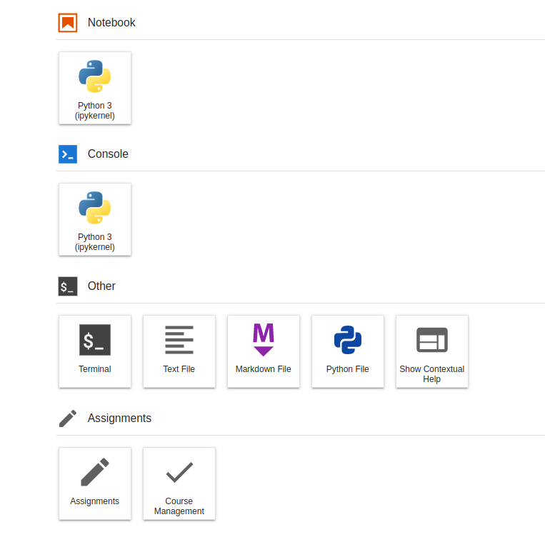
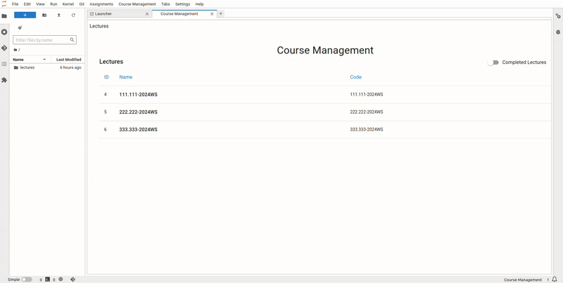

# Get Started

The grader labextension provides two launchers within JupyterLab:

- **Assignment Launcher**:  
  Opens a window where students can access and work on assignments you have published. Instructors can also open this view to preview how assignments appear to students.

- **Course Management Launcher**:  
  Opens a dashboard for instructors to manage assignments. You can add, edit, or delete assignments. This launcher is only visible if the current user has at least tutor-level access in one of the lectures.



```{note}
If you do not see the launcher items, it could be due to one of the following reasons:

- Extensions may be disabled in JupyterLab. Refer to the [JupyterLab extension management guide](https://jupyterlab.readthedocs.io/en/stable/user/extensions.html#managing-extensions-using-the-extension-manager) to enable them.
- The `grader-service` backend may not be running. In this case, a warning should appear in the interface.
```

---

# Renaming a Lecture

When a lecture environment is first provisioned via JupyterHub, it is typically named using the lecture code followed by the semester (unless configured otherwise). To make it more recognizable for students (and yourself), you are encouraged to rename it to the natural course title.

If the current lecture name still matches the default code, the system will automatically prompt you to rename it.

