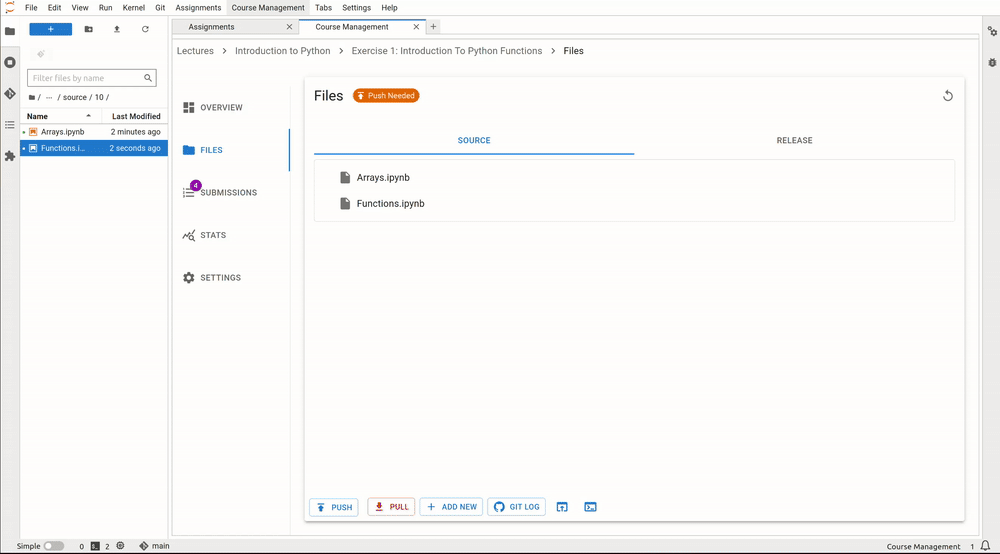

# Create Your First Assignment

Before students can access the notebooks, an assignment must be created.
To access this feature, open the course management dashboard and navigate to desired lecture:

The course management table lists all assignments in the chosen lecture and lets you easily manage them:

By pressing on the "+ NEW" button on top of the assignment list, you can add new assignments to the lecture:

After you initially created an assignment, you can allways change its properties in the "SETTINGS" panel:

## Files

Every assignment includes two crucial directories.
The **source directory** contains the source notebooks which instructors create for their assignment.
The **release directory** contains the release versions of the notebooks, which are the converted source notebooks and are used as a preview of what the student version of the notebook looks like.
To view these directories, use the files card in the overview window of the assignment.
By switching between source and release file viewer, the extension will convert the source notebooks to their release versions.

:::{note}
Just the source notebooks and files should be edited! Changes to files in the release directory will be lost when generating the files again.
:::

The grader service and labextension use git to support the collaborative creation of assignments. Also, it provides a simple way to distribute the files to the students.
Notebooks can be added by either using the "Create a new notebook" button or by copying files directly into the correct source directory via the file browser on left-hand side.

The source directory can also be revealed in the JupyterLab file browser or be opened in a terminal window.

(creating-a-notebook-target)=
## Creating a Notebook for an Assignment

Up until now, no files have been added to the assignment. To have tasks for students to work on, notebooks have to be added to the assignment.
As mentioned previously, we can either add a notebook from the file view or create it using the JupyterLab launcher.

For notebooks which are in the source directory, a creation mode can be enabled in the notebook toolbar. It adds widgets around notebook cells that can be used to control the function of the code cell.

Grader Cell Types:

- Readonly
  : This cell is locked and editing is disabled.
- Autograded answer
  : This cell contains the code for the solution of a task.
    It has to be surrounded by  `BEGIN SOLUTION` and `END SOLUTION` directives as comments around the actual solution code.
    Due to the directives, the code will be replaced by placeholder code such as `raise NotImplementedError()`.
    Also, a hint can be given to students and solutions can be commented while grading.

  

    :::{warning}
    If the `BEGIN SOLUTION` and `END SOLUTION` directives are omitted, the solution code will end up in the released files!
    :::
- Autograded tests
  : This cell contains the test cases to test the auto-graded answer given by students.
    These may be `assert` statements that check the implemented code.
    Invalid solutions have to lead to an exception.
  
  

    :::{note}
    Part or all of the tests can be hidden with `BEGIN HIDDEN TESTS` and `END HIDDEN TESTS` directives.
    :::

    Tests can also always be hidden with the use of `BEGIN ALWAYS HIDDEN TESTS` and `END ALWAYS HIDDEN TESTS` directives. 
    This means that students won't see tests which were executed in the feedback they receive. This behavior might be desired for **fully automatic** grading scenarios, 
    where students receive feedback as soon as they submit their work and can continue working on their assignments. So if you don't want to allow them where they exactly made a mistake, 
    but want to let them know how many points a submission granted  them, this a perfect option for you.

  

   The following image shows both an "always hidden" and a "hidden" test cell in the feedback view. For "always hidden" tests, only the points reached for the executed tests are shown, whereas for "hidden" tests, the run tests are also displayed.
    
   

  :::{warning}
    The students can still see the error traceback which allows them to view the test cases that failed. If you want 
    to avoid that, you can add `%xmode minimal` at the beginning of the text section.
  :::
   
- Manual graded answer
  : This cell type supports free-form answers from students.
    They should not be tested with automatic tests but are intended to be manually graded.
    The cells can be configured to either be code or markdown cells, so students can either implement code or answer in text. You as instructor are responsible for granting them points for the task (cell) for which "manual graded answer" was chosen. 

  

## Pushing only Selected Files from the Source Repository

As an instructor, you also have the option **not to push all files** you edited in your source repository. If you made changes to assignment files but only want to push specific files, you can do so by clicking the "PUSH" button, then expanding the dropdown list and selecting the files you want to push. The default behavior is to push all files from the source repository. This feature is helpful if you're working on multiple assignment files, have finished one but not another, and need the changes in one file to be available to students—or if you want to push it for yourself before releasing the assignment to students.

In the following example, the instructor has edited both assignment files, *Arrays.ipynb* and *Functions.ipynb*, but has only finished editing *Functions.ipynb*. Therefore, they select only this file to push. If the assignment is released, students will see the changes the instructor made only in the file that was pushed.

# Working With Assignments

Once an assignment has been created it can be opened, which will display the overview window.
In the overview window of the assignment, you will find many ways to monitor, grade and extend the current assignment.

## Assignment Lifecycle

An assignment can have 3 states that can be switched between and represent the lifecycle of the assignment.

- Edit
  : When first created, the assignment is in "Edit mode", where the assignment files can be added and edited.
    In this stage, the assignment is not visible to students. However, when an instructor opens the student view ("Assignments" card in launcher), it will be displayed to them.
- Released
  : The assignment is released to students and the students can work on it.
    The released files are identical to the files in the release directory at the time of the release.
    It is possible to undo the release and publish a new release. However, some students may have already pulled the old release.
    In this case the students might have to reset their files and might loose progress, which has to be communicated.
    In general, a re-release should be avoided.

    :::{warning}
    Revoking a released assignment may lead to diverging states of student files and submissions that fail auto-grading.
    :::
- Completed
  : The assignment is over and cannot be worked on anymore and new submissions will be rejected, but it is still visible.
    This state can be revoked without any consideration and will return to a released state.

## Assignment Settings

### Groups

You can assign assignments to a group you specify. This allows you to cluster assignments based on different criteria, e.g. the chapters of your lecture. Please note that each assignment can be assigned to only one group. 

### Deadlines

As an instructor, you can set deadlines for assignments.

**Deadline Enforcement**:  
After the set deadline, students will no longer be able to submit assignments unless you extend the deadline. This ensures that no submissions are accepted beyond the initial due date.

**Extending Deadlines**:  
While students cannot submit after the deadline by default, you have the option to extend the deadline for all students at any point. This can be done through the assignment settings, allowing flexibility if needed. Please note that deadlines cannot be extended for individual students.

### Limit Number of Submissions

You can set a limit on the number of times students can submit an assignment.

**Submission Limits**:  
You can define a maximum number of submissions for each assignment (e.g., students can submit up to 3 times). Once a student reaches this limit, they will no longer be able to make additional submissions unless you increase the limit for all students.

### Cell timeout

This field allows you to dynamically set the timeout of a cell per assignment in seconds. This means that the running time of each cell in the notebook(s) of the assignment will be limited by the value you specify. Please note that setting timeout for each cell separately is not possible.

### Whitelist File Patterns

By using `glob patterns` you can define which additional files can be submitted by the students. This allows you to have a better control over students' submissions and avoid getting unnecessary files from their side. 

### Late Submissions

You can allow students to submit assignments after the deadline, with applied penalties on the total score.

**Penalty for Late Submissions**:  
When students submit assignments after the initial deadline, a penalty multiplier can be applied to their score. This penalty increases with time, reducing their overall grade based on how late the submission is. You can customize the penalty system according to your course policies.

**Late Submission Period**:  
You can define a grace period for late submissions (e.g., allowing submissions up to a week after the deadline). Once this period expires, no further submissions are allowed unless you manually extend the deadline or late submission period. **Since the late submission period is relative to the deadline, extending the deadline automatically extends the late submission period.**

## Auto-Grading Behavior

In the settings and creation menu of an assignment, it is possible to select the auto-grading behavior for the assignment.
It specifies the action taken when a user submits an assignment.

- No Automatic Grading
  : No action is taken when users submit the assignment.
- Automatic Grading (Recommended)
  : The assignment is being auto-graded as soon as the user submits the assignment.
    This means that submissions in the grading view are always auto-graded.
- Fully Automatic Grading
  : The assignment is auto-graded and feedback is generated as soon as the student submits their assignment.
    This requires that no manually graded cells are part of the assignment.

## Grading Assignments

To grade student submissions navigate to submissions tab:

Submissions can be selected from the list and actions can be performed on the submissions.

Grader Service supports batch auto-grading and batch feedback generation of several submissions.
Naturally, submissions have to be manually graded individually. You can read more about how to manually assign points to grading cells in the section [Creating a Notebook for an Assignment](#creating-a-notebook-target).

Generally, submissions have to be auto-graded first before anything else can be done.
If manual grading is not needed or not wanted, it can be skipped.
The last step is feedback generation, at which point students will see their results.

## Manual Submissions

You have the ability to manually add submissions for students, even after the deadline has passed.

**Manual Submission Creation**:  
In cases where a student is unable to submit their work on time due to technical issues or other circumstances, you can manually upload and submit files on their behalf. This option is available even after the deadline has expired, giving you flexibility in handling special cases.

**Submission Process**:  
To manually submit on behalf of a student, you will need to obtain the necessary files from the student. Once you have the files, you can upload them to the system, and the submission will be recorded as if the student had submitted it themselves. Afterward the submission is handled as any other and can be graded as usually.

Following video illustrates the procedure:

   
### How To Grade Manual Answer Cells?
  - Once a student submits their work, it will appear in the "Submissions" list. To manually grade a submission, it must first be automatically graded (this sets the necessary metadata for successful grading). If you selected "Automatic Grading" when creating the assignment, this will be done automatically and you may immediately proceed with manual grading. If you chose "No Automatic Grading," you must first select the submission and click "AUTOGRADE." Afterward, you will be able to manually grade the submission.
  - Click on submission in the Submission List and pull it. This will reveal files the student has submitted.
  - Click on notebook that you want to manually grade and when the notebook opens up enable "Grading Mode".
  - You can now assign points, leave comments or even give extra credits for the solution.
  - When you are done with grading, save the notebook.
  - In the "Detail Submission View" click on "Finish Manual Grading". This will save points you granted the student.
  - When you are ready, you can also generate feedback for the submission. If you left any comments for the student while grading, they will be included in the feedback as well.
  
  Following video illustrates the procedure:

  

  Feedback student receives from the manual grading in the previous video looks like following:
  

  :::{note}
  If your assignment has cells that are automatically graded, you can always change points that the automated test granted for solution manually.
  
  In following example, student had to implement a python function that reverses a string, but they have used a _for loop_ for doing so. Since instructor thinks that a more elegant solution would be without _for loop_, instructor decides to reduce points auto grading has granted:
  
  :::

## Edit Student's Submission

Sometimes a student may make a minor mistake in their submission that causes them to lose many points in grading, or autograding may fail due to an error in the student's submission. As an instructor, you have the option to edit a student's submission and grade it. The workflow is as follows:

- Click on the submission in the "Submissions" list to open the manual grading window.
- Click the "EDIT SUBMISSION" button.
- In the Edit Submission window, create a repository for the edited files, then pull the student's submission. By clicking on a file in the list, you will be able to edit the student's submission.
- After saving the edited files, push them back.
- When you return to the manual grading view, you can autograde the assignment again, and you’ll see that the changes are applied (autograding works, or the points reflect your changes).

The following example illustrates a scenario where a student received 0 points due to a minor spelling mistake. The instructor decided to correct the mistake, so the student receives the points. After editing and pushing the submission files, the submission is autograded again, and the student receives points for the exercise the instructor edited.

