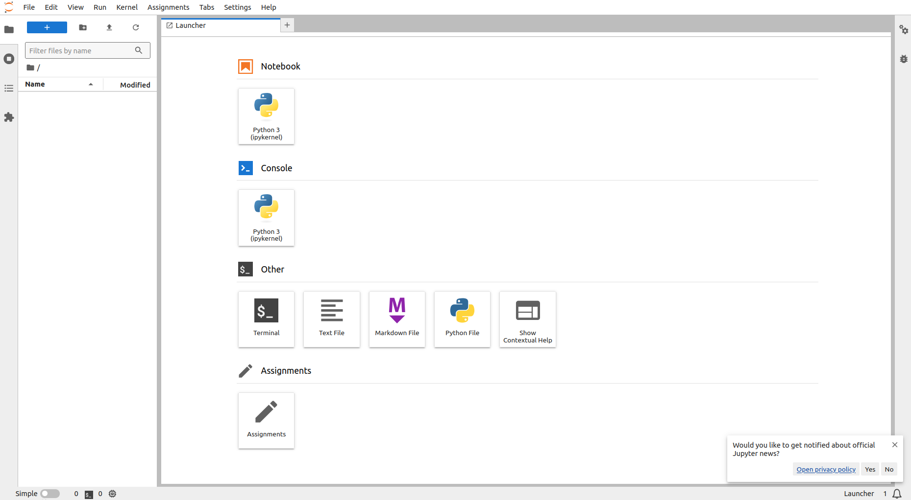
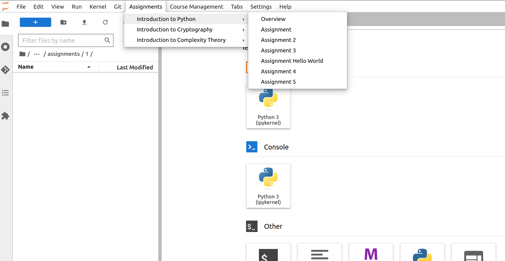
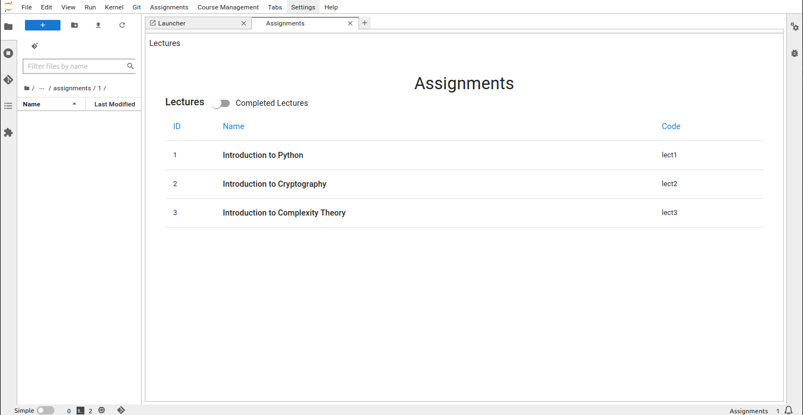
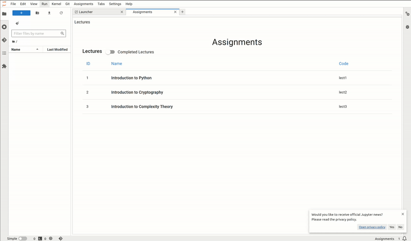
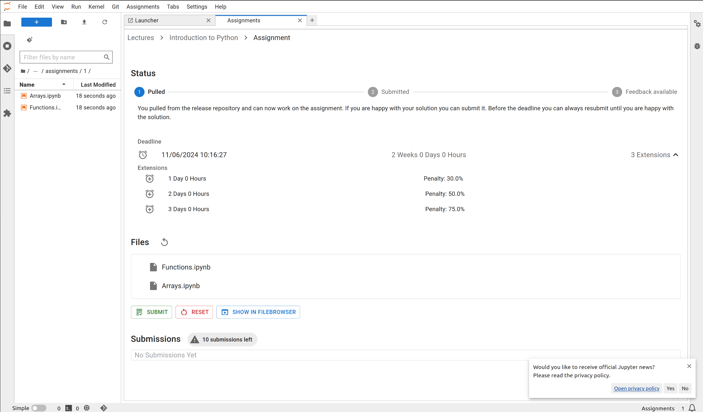
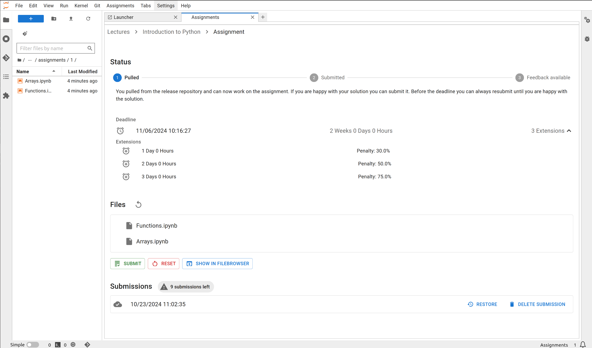
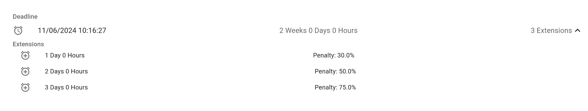
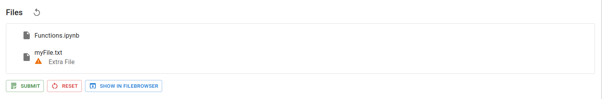
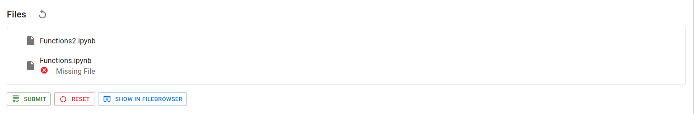

# Student Guide

## Lectures and Assignments

When JuypterHub is launched you see the Assignments card in the launcher:

You can also access the assignments through the 'Assignments' menu bar item.

When clicking on the assignment panel, you are presented with a list of courses you are enrolled in. You can also see completed lectures from previous semesters and take a look at your old assignments.

Each lecture has its dedicated assignment table, with each table cell representing an assignment along with a brief overview.

## Working on Assignments

If a new assignment was released, you must first pull it from the remote repository in order to obtain assignment files you can work on. Afterward, an "Edit" icon will be shown in the table cell.

Each table cell displays the name of the assignment, indicates whether feedback for submission is available, and shows the maximum points reached in the submission. Each table cell also features a countdown of the deadline. Once the deadline has been reached, you can no longer submit the assignment files.

When clicking on an assignment table cell or the 'Detail View' button, you are presented with a detailed view of the assignment, which allows you to edit assignment files and submit them. You are also presented with assignment status which indicates your progress.

The status bar guides you through the assignment stages, from working on the assignment to viewing the feedback you received.

The files in the assignment are displayed in a list and can be opened from there. The submit button submits the current state of the assignment.
To reset the assignment to its original state, you can use the reset button.
No progress is lost when resetting the assignment, the release state is just a new commit in the underlying git repository.

## Submissions and Feedback

Submissions you made are presented in the submission list. On top of the submission list is a chip that tells you whether there is a limited number of submissions you are allowed to make until the deadline has been reached.

## Late Submissions

The system allows for late submissions, but with penalties applied based on the amount of delay after the deadline, if configured by the instructor. If instructor allowed for a late submission, you will see penalties right below the progress (status) bar in your assignment detail view.

**Penalty Multiplier**:  
When an assignment allows for late submission and a submission is made after the initial deadline, a penalty multiplier will be applied to the score. The later the submission, the higher the penalty. The exact penalty schedule and multipliers are determined by the course settings (e.g., 10% deduction per day late).

**Late Submission Period**:  
After the late submission period(s), no further submissions are allowed. This means once this period has passed, submitting assignments will no longer be possible, and it will be treated as if the regular deadline has expired. The specific duration of the late submission period (e.g., 2 days, 1 week) depends on the course setup.

## Deleting Submissions

You have the option to delete your submissions, but this action has certain limitations. When you delete a submission, it will no longer appear in the instructor's grading view. This means that the instructor can't view or grade it. However, it must be noted that the deletion only affects the grading process and not the underlying submission record.

**Impact on Submission Limit**:  
If there is a submission limit set for the assignment (e.g., students can only submit up to 3 times), deleting a submission does not restore a submission opportunity. Each deleted submission will still count toward the total submission limit. For example, if you submit twice and delete both submissions, you will still only have one remaining submission attempt.

Example of how deleting your submission, does not affect the remaining number of submissions if the limit was set by instructor:

**Don't delete your only remaining Submission if Submission Limit is Set**

If your instructor set limit to how many times you are allowed to submit an assignment, make sure not to delete your only remaining submission. If Submission Limit was set to 10 as in the example in pictures and you have submitted your assignment 10 times and deleted 9 out of 10 submissions, make sure not to delete your only remaining submission. This will result in you being graded zero points on your assignment! The instructor won't be able to see any of the submissions you have made before.

## Restoring Submissions

You have the ability to restore a previous submission, which reverts the assignment files to the state they were in during that submission.

**Restore Submission Functionality**:  
At any point, you can choose to restore the files associated with any of your previous submissions. When you select this option, the system will reset the current state of your assignment to match the files and conditions of the selected submission. This can be useful if you want to revert changes you’ve made since the last submission or review and edit based on a prior version.

**Current State Is Not Saved**:  
Restoring a submission will overwrite the current state of your assignment. The files in your workspace will be replaced with those from the restored submission, and any unsaved progress will be lost. You can restore any of your previous submissions, whether it’s the most recent one or an earlier version. There’s no limit to how many times you can restore a submission.

## Extra and Missing Files

If you add a file to your repository that originally wasn't in it, that file will have a note to itself, describing it as an "Extra File". You can make submission, although you have an extra file, but that file will be removed while grading your submission, meaning the system won't recognise it.

If you delete a file that was part of the assignment, it will be marked as "Missing File." If your submission is missing a file that was initially included in the assignment and is essential for grading, you risk losing points and receiving a lower score. If you don’t have a local copy of the deleted file, you can either reset the assignment to restore the missing file or restore one of your submissions where the file was included.

## Feedback

Once your submissions have been graded and feedback is available, you will see _Open Feedback_ badge in the submission list. Once you received feedback, you won't be able to delete your submission anymore.

To access your feedback, click on "Open Feedback" badge in the submission list. You will first have to pull the feedback which is going to present you with `html` files generated from your assignment files. The detailed feedback is an HTML file and shows your answers along with the score and comments from instructors.

